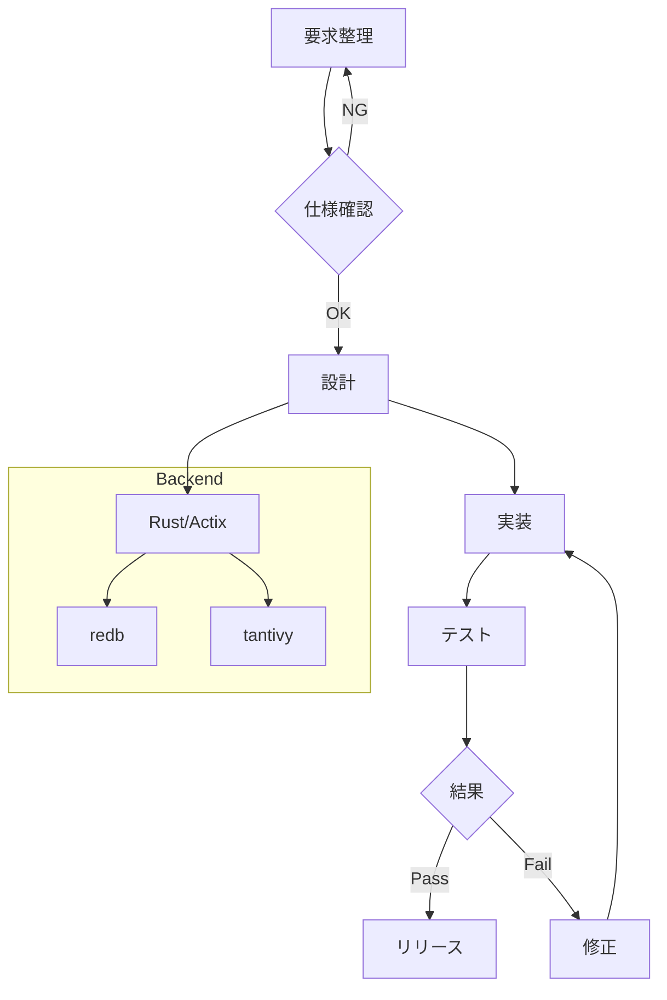

# Sandbox

このページはMarkdownと拡張記法を試すための練習用ページです。自由に編集してください。

## 基本的なMarkdown記述例

### 見出し
## 見出し2
### 見出し3

### 強調
- **太字**
- *斜体*
- ~~打ち消し~~

### リスト
- 箇条書き1
- 箇条書き2
  - ネスト

1. 番号付き1
2. 番号付き2

### 引用・コード・表
> これは引用です。

`inline code`

```rust
fn main() {
    println!("hello sandbox");
}
```

| 列A | 列B | 列C |
|:--|:--:|--:|
| left | center | right |
| 1 | 2 | 3 |

### リンク

#### 外部リンク
外部サイトへのリンクです。`http://` または `https://` を指定します。

- 記述例:
  - `[Rust公式サイト](https://www.rust-lang.org/ja)`
  - `<https://example.com>`

#### ページリンク（内部リンク）
Wiki内のページへのリンクです。相対パス・絶対パスのどちらでも記述できます。

- 記述例:
  - `[Welcome](/)` （ルートページへのリンク）
  - `[Sandbox](/Sandbox)` （絶対パス）
  - `[このページへの相対リンク](./Sandbox)` （相対パス）
  - `[[/Sandbox]]` （特例マクロ形式）
  - `[[/Sandbox|Sandboxページ]]` （特例マクロ + 別名）

#### 参照型リンク（Reference style）
リンク定義を末尾にまとめる形式も利用できます。

- 記述例:
  - `[Rust公式][rust-site]`
  - `[Sandboxページ][sandbox-page]`

リンク定義:

```md
[rust-site]: https://www.rust-lang.org/ja
[sandbox-page]: /Sandbox
```

#### title属性付きリンク
リンクに補助説明（`title` 属性）を指定できます。

- 記述例:
  - `[Rust公式サイト](https://www.rust-lang.org/ja "Rust language official")`
  - `[Sandbox](/Sandbox "練習ページへ移動")`

以下の様に参照型リンクのリンク定義でも指定可能です。

```md
[rust-site][https://www.rust-lang.org/ja "Rust公式サイト"]
```

#### 外部リンクとページリンクの違い
- 外部リンク:
  - ブラウザで外部URLへ遷移します。
- ページリンク:
  - Wikiのページ閲覧URL（`/wiki/...`）へ遷移します。

#### 未作成ページへのリンク
- 記述例:
  - `[未作成ページの例](/Sandbox/NewPageSample)`
- 挙動:
  - 仕様上、未存在リンクとして扱われます。
  - クリックすると新規ページ作成フローへ遷移します（閲覧URLから編集URLへ誘導）。

## 拡張機能

### チェックボックスリスト
- [ ] 未完了タスク
- [x] 完了タスク

### マクロ

このシステムのマクロは、次の3種類があります。

1. 即時変換型
   - 入力時に展開されるマクロです。ソースには残りません。
2. レンダリング時変換型
   - ソースに残り、表示時に展開されるマクロです。
3. 特例マクロ
   - 他Wiki系の記法互換として扱う特別なマクロです。

#### 即時変換型マクロ（全種類）

入力形式は `{{マクロ名:引数..}}` です。

##### now
現在日時を展開します。

- 記述例:
  - `{{now}}`
  - `{{now:utc}}`
  - `{{now:iso8601}}` (`{{now:iso}}` も可)
  - `{{now:utc:iso8601}}`
- 引数:
  - `utc`: UTCで展開（省略時はローカル時刻）
  - `iso8601` / `iso`: ISO8601形式で展開

##### today
現在日付を展開します。

- 記述例:
  - `{{today}}`
  - `{{today:utc}}`
  - `{{today:iso8601}}` (`{{today:iso}}` も可)
  - `{{today:utc:iso8601}}`
- 引数:
  - `utc`: UTCで展開（省略時はローカル日付）
  - `iso8601` / `iso`: ISO8601形式で展開

##### page
ページ情報を展開します（既定はページパス）。

- 記述例:
  - `{{page}}`
  - `{{page:id}}`
  - `{{page:basename}}` (`b` / `bn` も可)
- 引数:
  - `id`: ページIDを展開
  - `basename` (`b`, `bn`): ページ末尾名を展開
- 注記:
  - `id` と `basename` の同時指定は不可

##### user
ユーザ情報を展開します（既定はユーザID）。

- 記述例:
  - `{{user}}`
  - `{{user:display}}` (`d` も可)
- 引数:
  - `display` (`d`): 表示名を展開

#### レンダリング時変換型マクロ（全種類）

入力形式は `{{マクロ名:引数..}}` です。

##### children
配下ページのリンク一覧を展開します。

- 記述例:
  - `{{children}}`
  - `{{children:depth=2}}` (`d=2` も可)
  - `{{children:recursive}}` (`r` も可)
- 引数:
  - `depth={number}` (`d`): 表示深さ
  - `recursive` (`r`): 配下を再帰表示
- 注記:
  - `depth` と `recursive` の同時指定は不可
  - 省略時は `depth=1`

##### toc
ページ内見出しから目次を展開します。

- 記述例:
  - `{{toc}}`
  - `{{toc:depth=4}}` (`d=4` も可)
- 引数:
  - `depth={number}` (`d`): TOCに含める深さ

##### include_code
指定アセットをコードブロックとして展開します。

- 記述例:
  - `{{include_code:src=./sample.rs}}`
  - `{{include_code:src=./sample.rs:lang=rust}}`
- 引数:
  - `src={asset_path}` (`s`): 取り込むアセット（必須）
  - `lang={string}` (`l`): コード言語（任意）

展開例（このページに配置済み `sample.rs`）:

`{{include_code:src=./sample.rs:lang=rust}}`

{{include_code:src=./sample.rs:lang=rust}}

##### include_csv
指定CSVアセットをテーブルとして展開します。

- 記述例:
  - `{{include_csv:src=./table.csv}}`
- 引数:
  - `src={asset_path}` (`s`): 取り込むCSVアセット（必須）

展開例（このページに配置済み `table.csv`）:

`{{include_csv:src=./table.csv}}`

{{include_csv:src=./table.csv}}

#### 特例マクロ

- ページリンク:
  - `[[/Sandbox]]`
  - `[[/Sandbox|Sandboxページ]]`
- アセット埋め込み:
  - `![[asset:/Sandbox:image.png]]`

#### Mermaid埋め込
コードブロックの言語指定を`mermaid`とした場合、Mermaidのレンダリングを行いその結果を表示します。



### 数式埋め込み
インライン数式(`$...$`)とブロック数式(`$$ .... $$`)をサポートしています。

#### インライン数式

インライン数式の例 $E = mc^2$

#### ブロック数式

ブロック数式の例
$$
\int_{0}^{\infty} e^{-x^2} dx = \frac{\sqrt{\pi}}{2}
$$
